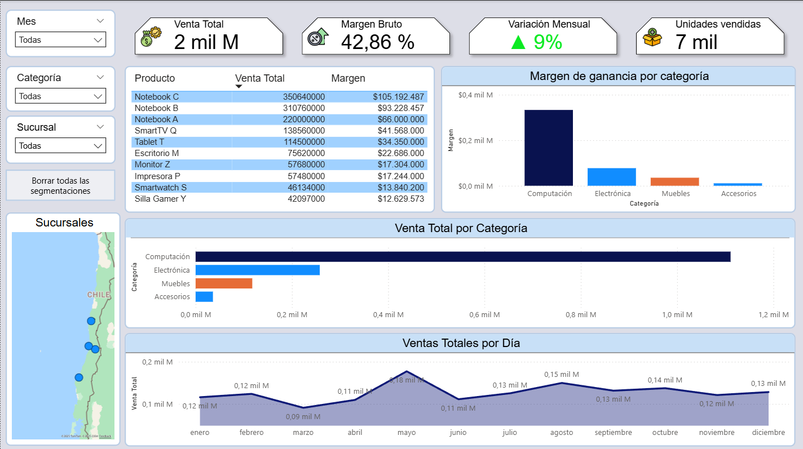
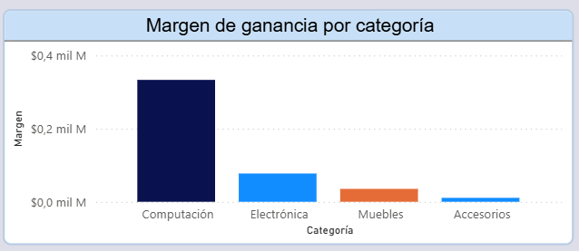
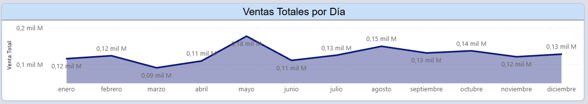
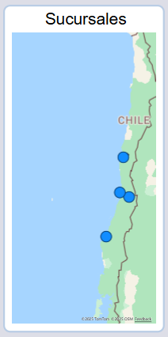

# 📊 Dashboard de Ventas – Power BI (2024)

Este proyecto presenta un **dashboard profesional de análisis de ventas** desarrollado con **Power BI**, como parte de un portafolio de analítica y visualización de datos.
Incluye métricas clave, gráficos interactivos, cálculo de variación mensual (MoM), análisis de márgenes y visualización geográfica por sucursal.

---

## 📁 Dataset

Se utilizó un dataset de **1.000 filas** correspondiente al año **2024 completo**, generado especialmente para análisis avanzados.
El dataset incluye:

* **17 productos**
* **5 categorías**
* **4 sucursales**
* Cantidades simuladas de forma realista
* Precios y costos basados en productos reales
* Estacionalidad mensual

📄 Archivo:
`/dataset/ventas.xlsx`

---

## 🧠 KPIs incluidos

* **Ventas Totales**
* **Margen Bruto (%)**
* **Margen de Ganancia**
* **Variación Mensual (MoM %)**
* **Unidades Vendidas**

---

## 📈 Gráficos principales

* **Ventas por Categoría**
* **Margen de Ganancia por Categoría**
* **Tendencia de Ventas por Mes**
* **Mapa de Ventas por Sucursal**
* **Ranking de Productos (Ventas y Margen)**

---

## 🛠 DAX utilizado

### **Venta Total**

```DAX
Venta Total =
SUMX(ventas, ventas[Cantidad] * ventas[PrecioUnitario])
```

### **Venta Mes Anterior**

```DAX
Venta Mes Anterior =
CALCULATE(
    [Venta Total],
    DATEADD(ventas[Fecha], -1, MONTH)
)
```

### **Variación MoM %**

```DAX
Variación MoM % =
VAR mesActual = [Venta Total]
VAR mesAnterior = [Venta Mes Anterior]
RETURN
DIVIDE(mesActual - mesAnterior, mesAnterior)
```

---

## 🧰 Tecnologías utilizadas

* **Power BI Desktop**
* **DAX (Data Analysis Expressions)**
* **Modelamiento de datos**
* **Python** (para generar el dataset)

---

## 📸 Capturas del dashboard

### Vista completa  


### KPIs  


### Categorías  


### Tendencia  


### Mapa  


---

## 👨‍💻 Autor

**Valentina Valdivia**
Power BI · SQL · Data Analytics
Chile 🇨🇱
